This stack creates VPC with NAT GW and insecure AWS EKS cluster in auto mode

## Requirements

| Name | Version |
|------|---------|
|  [aws](#requirement\_aws) | ~> 5.0 |
|  [kubectl](#requirement\_kubectl) | 0.27.0 |

## Providers

| Name | Version |
|------|---------|
|  [aws](#provider\_aws) | 5.98.0 |
|  [kubectl](#provider\_kubectl) | 0.27.0 |

## Modules

| Name | Source | Version |
|------|--------|---------|
|  [eks](#module\_eks) | git::https://github.com/terraform-aws-modules/terraform-aws-eks.git | 37e3348dffe06ea4b9adf9b54512e4efdb46f425 |
|  [vpc](#module\_vpc) | git::https://github.com/terraform-aws-modules/terraform-aws-vpc.git | 7c1f791efd61f326ed6102d564d1a65d1eceedf0 |

## Resources

| Name | Type |
|------|------|
| [kubectl_manifest.ingress_class](https://registry.terraform.io/providers/bnu0/kubectl/0.27.0/docs/resources/manifest) | resource |
| [kubectl_manifest.ingress_class_params](https://registry.terraform.io/providers/bnu0/kubectl/0.27.0/docs/resources/manifest) | resource |
| [aws_caller_identity.current](https://registry.terraform.io/providers/hashicorp/aws/latest/docs/data-sources/caller_identity) | data source |
| [aws_eks_cluster_auth.cluster](https://registry.terraform.io/providers/hashicorp/aws/latest/docs/data-sources/eks_cluster_auth) | data source |

## Inputs

| Name | Description | Type | Default | Required |
|------|-------------|------|---------|:--------:|
|  [common\_tags](#input\_common\_tags) | Common tags to apply to all resources | `map(string)` | <pre>{   "CostCentre": "CostCentreExample",   "Environment": "dev",   "Owner": "telecomprofi",   "Project": "eks-auto-example" }</pre> | no |

## Outputs

No outputs.
This repo has github actions enabled and checks for security issues with checkov and trivy before merge, as well as with SonarQube

```mermaid

graph TD
%% AWS Core Infrastructure
    subgraph A[AWS Core Infrastructure]
        AWS_ACCOUNT[AWS Account] --> VPC[VPC & Subnets];
        VPC --> EKS_CLUSTER[EKS Cluster];
        EKS_CLUSTER --> EKS_NODE_GROUPS[EKS Node Groups];
        EKS_CLUSTER --> EKS_OIDC_PROVIDER[EKS OIDC Provider];
        EKS_NODE_GROUPS -- IAM Role for Nodes --> EKS_CLUSTER;
    end

%% Database Layer RDS MS-SQL
    subgraph B[Database Layer]
        RDS_SQL[RDS MS-SQL Instance]
        RDS_SQL -- "VPC Subnet Group" --> VPC;
        RDS_SQL -- "Security Group for RDS" --> EKS_NODE_GROUPS[Inbound from EKS Nodes/Pods];
        RDS_SQL -- "Connection Details Host, Port, DB Name, User, Pass" --> SECRETS_MANAGER[AWS Secrets Manager Secret];
        SECRETS_MANAGER -- "Secret ARN Output" --> IAM_ROLE_SECRETS_MANAGER[IAM Role for Secrets Manager Access];
        IAM_ROLE_SECRETS_MANAGER -- "Trust Policy" --> EKS_OIDC_PROVIDER;
        IAM_ROLE_SECRETS_MANAGER -- "Permissions GetSecretValue" --> SECRETS_MANAGER;
    end


%% Storage Layer (S3)
    subgraph C[Storage Layer]
        S3_BUCKET[S3 Bucket] --> IAM_ROLE_S3[IAM Role for S3 Access];
        IAM_ROLE_S3 -- "Trust Policy" --> EKS_OIDC_PROVIDER;
        IAM_ROLE_S3 -- "Permissions GetObject, PutObject" --> S3_BUCKET;
        S3_BUCKET -- "S3 Bucket ARN Output" --> IAM_ROLE_S3;
    end

%% Container Image Management ECR
    subgraph D[Container Image Management]
        CI_CD_PIPELINE[CI/CD Pipeline] --> ECR_REGISTRY[ECR Registry];
        ECR_REGISTRY -- "Image URI, Tag Output" --> DEPLOYMENT_INPUTS[Deployment Manifest Inputs];
    end

%%  Kubernetes Resources EKS
    subgraph E[Kubernetes Resources EKS Cluster]
        K8S_SVC_ACC_SECRETS[K8s Service Account for Secrets Manager]
        K8S_SVC_ACC_S3[K8s Service Account for S3]

        K8S_SVC_ACC_SECRETS -- "Annotation: eks.amazonaws.com/role-arn" --> IAM_ROLE_SECRETS_MANAGER;
        K8S_SVC_ACC_S3 -- "Annotation: eks.amazonaws.com/role-arn" --> IAM_ROLE_S3;

        K8S_SECRETS_MANIFEST[K8s Secrets Manifest e.g., via CSI Driver]
        K8S_SECRETS_MANIFEST -- "Reads Secret" --> SECRETS_MANAGER;
        K8S_SECRETS_MANIFEST -- "Uses Service Account" --> K8S_SVC_ACC_SECRETS;
        K8S_SECRETS_MANIFEST -- "Creates K8s Secret" --> K8S_DEPLOYMENT[K8s Deployment Manifest];

        K8S_DEPLOYMENT --> K8S_SERVICE[K8s Service Manifest];
        K8S_SERVICE --> K8S_INGRESS[K8s Ingress Manifest];

        DEPLOYMENT_INPUTS -- "Image URI, Tag Input" --> K8S_DEPLOYMENT;
        K8S_DEPLOYMENT -- "Uses Service Account" --> K8S_SVC_ACC_S3[Pods in Deployment use this SA for S3 access];
        K8S_DEPLOYMENT -- "Uses Service Account" --> K8S_SVC_ACC_SECRETS[Pods in Deployment use this SA for Secrets Manager via CSI driver];
        K8S_DEPLOYMENT -- "Ingests K8s Secret" --> K8S_SECRETS_MANIFEST;

        K8S_INGRESS -- "Requires" --> AWS_ALB_CONTROLLER[AWS ALB Controller in EKS];
        K8S_INGRESS -- "ACM Cert Reference" --> ACM_CERTIFICATE[AWS ACM Certificate Not explicitly requested but good practice for HTTPS];
    end

%%  Deployment & Testing
    subgraph F[Deployment & Testing]
        CI_CD_DEPLOY[CI/CD Pipeline Deploy Stage] --> K8S_DEPLOYMENT;
        CI_CD_DEPLOY --> K8S_SERVICE;
        CI_CD_DEPLOY --> K8S_INGRESS;
        CI_CD_DEPLOY --> K8S_SECRETS_MANIFEST;
        K8S_INGRESS -- "Provisions ALB" --> PUBLIC_IP_ENDPOINT[Public IP / DNS Endpoint ALB];
        PUBLIC_IP_ENDPOINT -- "HTTP/HTTPS Request" --> SMOKE_TEST[Smoke Test Curl 3x, 200 OK, <3000ms];
        SMOKE_TEST -- "Pass/Fail" --> CI_CD_DEPLOY;
    end

%% Interactions and Data Flow
    style IAM_ROLE_SECRETS_MANAGER fill:#f9f,stroke:#333,stroke-width:2px
    style IAM_ROLE_S3 fill:#f9f,stroke:#333,stroke-width:2px
    style K8S_SVC_ACC_SECRETS fill:#ccf,stroke:#333,stroke-width:2px
    style K8S_SVC_ACC_S3 fill:#ccf,stroke:#333,stroke-width:2px
    style EKS_OIDC_PROVIDER fill:#fcc,stroke:#333,stroke-width:2px

%% Flow of credentials/data
    RDS_SQL -- "Connection Info" --> SECRETS_MANAGER;
    SECRETS_MANAGER -- "Secret Value via IRSA & CSI Driver" --> K8S_SECRETS_MANIFEST;
    K8S_SECRETS_MANIFEST -- "K8s Secret Object" --> K8S_DEPLOYMENT;
    K8S_DEPLOYMENT -- "Pod Credentials via IRSA" --> S3_BUCKET;
    K8S_DEPLOYMENT -- "Pod Credentials via IRSA" --> SECRETS_MANAGER[If pods directly access secrets manager];

    PUBLIC_IP_ENDPOINT -- "Access Web App" --> K8S_INGRESS;
    K8S_INGRESS -- "Routes Traffic" --> K8S_SERVICE;
    K8S_SERVICE -- "Forwards Traffic" --> K8S_DEPLOYMENT;

    CI_CD_PIPELINE -- "Pushes Image" --> ECR_REGISTRY;

    classDef awsResource fill:#ADD8E6,stroke:#333,stroke-width:2px;
    class RDS_SQL,SECRETS_MANAGER,S3_BUCKET,ECR_REGISTRY,EKS_CLUSTER,EKS_NODE_GROUPS,VPC,AWS_ACCOUNT,AWS_ALB_CONTROLLER,ACM_CERTIFICATE,EKS_OIDC_PROVIDER awsResource;

    classDef k8sResource fill:#c9f,stroke:#333,stroke-width:2px;
    class K8S_SECRETS_MANIFEST,K8S_DEPLOYMENT,K8S_SERVICE,K8S_INGRESS,K8S_SVC_ACC_SECRETS,K8S_SVC_ACC_S3 k8sResource;

    classDef process fill:#f2f2f2,stroke:#333,stroke-width:2px;
    class CI_CD_PIPELINE,CI_CD_DEPLOY,SMOKE_TEST,DEPLOYMENT_INPUTS process;

    classDef output fill:#D4EDDA,stroke:#333,stroke-width:2px;
    class PUBLIC_IP_ENDPOINT output;
```

